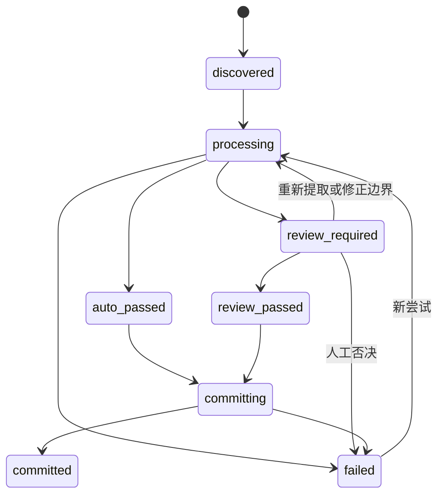

# 多格式法规摄取质量门禁与批次状态专项设计

**状态：** 已批准设计  
**日期：** 2026-06-28  
**角色：** `architecture_or_strategy` 总体架构下的专项分卷
**适用范围：** `法律文本/todo/` 多格式法规从统一中间格式到逐文件 append-only 提交的质量判定、状态管理与审计
**上位设计：** [法规摄取总体架构](./2026-06-29-legal-ingestion-overall-architecture.md)

## 1. 文档职责

本文档唯一负责：

- 定义通用及 Word、文本型 PDF、扫描型 PDF/OCR、S2、S3 专属门禁；
- 定义逐文件状态、合法转换、批次发现、失败隔离和审计报告；
- 说明现有 preflight、staging、commit、manifest 的复用与差距；
- 定义 14 份真实文件的 TDD 验收原则与禁止 skip 要求。

本文档不负责格式分类算法、提取器实现契约、正文边界算法、统一中间格式字段定义、OCR 引擎选型或逐步实施计划。
## 2. 质量判定原则

1. **提取成功不等于质量合格。** 文本非空、解析不报错或 chunk 非空都不能单独获得提交资格。
2. **先门禁，后提交。** 质量结论必须在正式 preflight、索引追加和发布之前确定。
3. **不确定不自动通过。** 语义边界、OCR 关键结构或阅读顺序存在歧义时进入待人工复核，禁止猜测。
4. **机械错误不能人工豁免。** 源文件摘要变化、产物格式损坏、排除内容进入语料等问题必须修复并重新运行门禁。
5. **证据可回溯。** 每个门禁必须记录检查对象、结果、证据位置、规则版本和判定时间。
6. **源文件只读。** 质量检查不得修改、重命名或移动 `法律文本/` 下的文件。
7. **逐文件负责。** 一份文件的失败不能降低其他文件的门禁标准，也不能回滚其他文件的成功提交。

## 3. 门禁结果模型

每个门禁产生下列结果之一：

| 结果 | 含义 | 后续 |
| --- | --- | --- |
| `pass` | 证据满足自动规则 | 继续下一门禁 |
| `review_required` | 产物可核验，但自动规则不能消除歧义 | 停止自动提交，等待人工复核 |
| `fail` | 本次运行无法形成合法候选产物，或发生不可豁免错误 | 停止处理，修复或重试 |

逐文件综合结论遵循最严格结果：任一 `fail` 则失败；无 `fail` 但存在 `review_required` 则待人工复核；全部为 `pass` 才能自动通过。

人工复核只允许确认有明确源证据支持的分类、边界、阅读顺序或 OCR 文本。复核通过后必须重新执行所有机械门禁；复核意见不能直接把失败结果改写为通过。
## 4. 通用质量门禁

| 门禁 | 自动通过条件 | 阻断结果 |
| --- | --- | --- |
| 源身份 | 相对路径、文件真实类型、大小与 SHA-256 完整；检查前后摘要一致 | 摘要变化或源不可读为 `fail` |
| 分类完整 | 提取轴与结构轴均确定；分类证据可回溯 | PX、S4 或分类冲突为 `review_required` |
| 提取完整 | 提取器输出契约合法；目标正文来源位置可回到源文件 | 输出损坏或目标正文不可提取为 `fail` |
| 边界确认 | `boundary.status=confirmed`；标题、正文首尾唯一 | 边界歧义为 `review_required`；边界不变量破坏为 `fail` |
| 页面或块覆盖 | 所有源页面或块均被归类为前置材料、目标正文、排除内容、空白或噪声；目标正文覆盖率为 100% | 未解释缺页、缺块为 `review_required`；正文页无内容为 `fail` |
| 条文起点 | 存在唯一目标标题和正式第一条 | 候选不唯一为 `review_required`；无正式条文为 `fail` |
| 条号连续 | 条号按法规结构连续且顺序单调 | 无已记录合法例外的跳号、倒序为 `review_required` |
| 条号唯一 | 同一目标正文内无重复条号 | 重复条号为 `review_required` |
| 条文非空 | 每条均有正文；章节标题不冒充条文正文 | 空条文为 `review_required` |
| 正文纯净 | 无页码域、字段代码、重复页眉页脚、孤立页码或印发信息 | 任一污染命中为 `fail` |
| 排除隔离 | 正文来源范围与排除范围不重叠；生成物不含排除内容 | 重叠或污染为 `fail` |
| 跨层一致 | 中间格式、normalized、structured、chunks 的标题、条文标识、来源范围和正文摘要一致 | 丢条、增条、错序或正文不一致为 `fail` |
| chunk 覆盖 | 每条目标条文都被下游可检索 chunk 覆盖，且不存在来自正文范围外的 chunk | 漏条、重复映射或越界 chunk 为 `fail` |
| 提交资格 | 所有必需门禁通过，或人工复核通过后重新执行机械门禁且通过 | 其他任何状态禁止进入 commit |

条号检查必须支持法规明确存在的增补条文等合法例外，但例外必须在报告中记录来源证据；不得用“解析器忽略异常条号”的方式获得通过。

正文纯净不能仅靠搜索“附件”二字判断。法规正文可能合法引用附件；排除污染必须依据来源范围交集、单元来源和跨层摘要判断。

## 5. Word 专属门禁

Word 包括 W 类 `.doc` 与 `.docx`，除通用门禁外必须检查：

- `PAGE \* MERGEFORMAT`、`NUMPAGES` 等 Word 域代码为零；
- HYPERLINK 等字段只保留可用显示文本，不保留字段指令；
- 重复页眉、页脚、独立页码和印发尾注未进入正文；
- 相邻条号未因文本框、换行或转换异常合并进上一条正文；
- 同一条文未因转换重复出现在相邻条文中；
- 表格、文本框或多栏内容若落在目标正文范围内，其阅读顺序可证明；不能证明时进入待人工复核；
- DOC 与 DOCX 分别记录转换器、版本、原始字符数、正文字符数、条文数和异常字段计数。

现有 `textutil` 能生成文本不构成自动通过证据。尤其是条文重复、页码域和最后一条污染均能产生非空 chunk，必须由本组门禁显式阻断。
## 6. 文本型 PDF 专属门禁

PT 类 PDF 必须检查：

- 每个目标正文页均能提取非空文字，目标正文页面覆盖率为 100%；
- 所有页面都有处理结果，不允许因单页异常静默跳过；
- 抽取阅读顺序与页面视觉顺序一致；多栏、侧注或坐标错序不能自动通过；
- 分页硬换行已按标点、缩进、条号和来源坐标重建，且没有跨条错误合并；
- 跨页条文保持同一条文身份，页眉页脚没有插入正文；
- 每个正文单元保留页码和来源坐标，可回到原页核验；
- 单页字符量异常突降、标题或条号只出现于异常顺序文本时进入待人工复核。

若 PDF 没有足够文本层，应重新分类并路由到 PS，而不是用空文本继续解析；分类转换及其证据必须进入状态历史。

## 7. 扫描型 PDF 与 OCR 专属门禁

PS 类 PDF 必须检查：

- 每个目标正文页均完成图像预处理和 OCR，正文页面覆盖率为 100%；
- 每页记录 OCR 引擎、模型或语言资源版本、预处理参数和置信度摘要；
- 标题、编章节目和“第X条”等关键结构标记使用独立的关键标记置信度；
- 中文数字条号经过连续性、重复性和相邻页交叉校验；
- 跨页条文合并后仍保留原页来源范围；
- 印章遮挡、倾斜、低分辨率、异常字符密度和大面积空白页均产生诊断；
- S3 排除区域的 OCR 或图像内容不得持久化到中间格式、报告或语料产物。

OCR 置信度阈值不得跨引擎硬套。选定引擎后必须通过真实中文法规样本标定版本化的 `T_fail` 与 `T_review`：

- 正文页无 OCR 内容或低于 `T_fail`，本次提取失败；
- 页面平均置信度低于 `T_review`，进入待人工复核；
- 任一关键结构标记低于 `T_review`，即使页面均值较高也进入待人工复核；
- 引擎不能提供可解释置信度时，PS 文件不得自动通过，只能人工复核。

## 8. S2 复合发布文件专属门禁

S2 除通用门禁外必须满足：

- 目标法规标题与完整连续条文块形成唯一配对；
- 发布通知、部门令、修订决定中的示例或修改条文未混入目标全文条号序列；
- 前置发布或修订材料未进入 normalized、structured、chunks；
- 从前置材料提取的机关、日期、修订事件和版本依据都带来源位置；
- 源文件明确包含版本事实而中间格式未提取时进入待人工复核；
- “修订决定”与“修订后全文”无法区分时不得自动通过；
- 文件名、目标标题和正文候选明显冲突时不得自动通过。

S2 中前置出现“附件”不能触发无条件截断。只有先唯一确认目标法规正文，再应用排除规则，才有资格通过。

## 9. S3 排除边界专属门禁

S3 的目标是证明排除内容没有被保存，而不是证明系统读过并保存了附件：

- 正文最后一条结束位置唯一且早于排除范围；正文单元不得与排除范围相交；
- 排除范围只记录开始、结束、类型和原因，不含标题、摘要、正文、OCR 文本或表格；
- normalized、structured、chunks、诊断和报告均不得出现排除内容副本；
- 排除内容穿插正文或无法用稳定边界隔离时升级为 S4，并进入待人工复核；
- 不得以第一次出现“附件”为截断点，也不得仅凭关键词宣告排除成功。

## 10. 逐文件状态机

状态保存在独立批次记录中；现有增量 manifest 继续只记录已经完整提交的事实。

| 状态 | 含义 | 是否可提交 |
| --- | --- | --- |
| `discovered` | 已进入本批次不可变输入清单 | 否 |
| `processing` | 正在分类、提取、边界识别或执行门禁 | 否 |
| `auto_passed` | 全部门禁自动通过 | 是 |
| `review_required` | 存在必须由人工核验的歧义 | 否 |
| `review_passed` | 人工核验有证据，且机械门禁重新运行通过 | 是 |
| `failed` | 本次尝试无法形成合法产物，或提交失败 | 否 |
| `committing` | 正在执行单文件 preflight、staging 与正式提交 | 否，不可重复发起 |
| `committed` | 正式语料、两类索引和 manifest 均提交成功 | 已完成 |

`committed` 是终态。重试必须创建新的 attempt 标识并保留旧状态历史，禁止覆盖失败证据。人工复核人、时间、依据和结论必须记录；没有这些字段不得进入 `review_passed`。

## 11. 批次语义与失败隔离

批次协调器必须递归发现 `todo/` 下所有候选文件，忽略 `.DS_Store` 等非业务文件，并在开始处理前冻结包含相对路径和 SHA-256 的输入清单。当前评估基线要求清单正好覆盖 14 份文件；处理期间新增的文件进入下一批次，不静默并入当前批次。

批次只负责发现、调度、状态汇总和报告：

- 每份文件拥有独立 attempt、staging、门禁结论和 commit 结果；
- 提取与门禁可独立执行；修改共享正式索引的 commit 必须串行化；
- 单份失败不阻止其他文件，也不回滚其他已提交文件；
- 不建立 14 份文件的全局事务，不提供批次级“全部回滚”；
- 批次执行结束可以是 `completed` 或 `completed_with_exceptions`；只有协调器自身无法继续时才是 `failed`。

`completed_with_exceptions` 只表示本轮调度已结束，不表示“处理 todo 全部法规”的阶段目标完成。该阶段目标只有在 14 份基线文件全部为 `committed` 时才完成。

## 12. 与现有 append-only 机制的集成

### 12.1 直接复用

- 正式写入前和提交前再次执行 `validate_append_only_preflight`；
- 每份文件使用独立 `data/.staging/`，在其中准备语料与正式索引副本；
- 正式语料文件独占创建，目标已存在即失败；
- 正式索引替换前保留可回滚备份；
- manifest 最后写入，提交异常时复用现有回滚；其中 `committed` 只表示整体提交成功。

### 12.2 必须补齐的差距

| 现有行为 | 本设计要求 |
| --- | --- |
| 只接受显式单个 `.doc/.docx` | 批次层全量发现，逐文件路由后仍调用单文件提交 |
| `normalize → parse → chunks` 后只检查 chunk 非空 | 在任何正式提交前执行统一中间格式与全部门禁 |
| staging 不保存质量判定 | 每个 attempt 关联机器可读门禁结果与状态历史 |
| manifest 只有 `committed` | transient 状态写独立批次报告，不污染提交事实 manifest |
| `CommitPlan` 不携带质量资格 | commit 入口必须验证不可伪造的合格判定引用及源摘要 |
| 提交时把来源类型构造成 `docx` | 保留真实来源类型、提取分类与提取器版本 |
| 真实 smoke 可因旧路径 `skip` | 直接绑定当前 14 份基线文件，缺失即失败 |

质量门禁不能放在现有 commit 之后。append-only 冲突会放大脏数据修复成本，因此 `auto_passed` 或 `review_passed` 是创建正式提交计划的前置条件。
## 13. 错误分类

| 错误类别 | 示例 | 默认结果 |
| --- | --- | --- |
| `discovery` | 清单缺文件、重复相对路径、源摘要变化 | `fail` |
| `classification` | 文件真实类型冲突、PX 或结构分类不唯一 | `review_required` 或 `fail` |
| `extraction` | 转换器失败、正文页无文本、OCR 无输出 | `fail` |
| `boundary` | 标题、正文首尾或排除范围不唯一 | `review_required` |
| `structure` | 跳号、重号、空条文、顺序异常 | `review_required` |
| `contamination` | PAGE 域、附件、评分表、模板或印发信息入正文 | `fail` |
| `quality_contract` | 跨层摘要不一致、chunk 漏条或越界 | `fail` |
| `preflight_conflict` | document_id、正式产物、索引或 manifest 已存在 | `fail` |
| `commit` | staged 索引无效、正式发布失败 | `fail` |
| `rollback` | 正式状态无法完全恢复 | `fail`，并标记需人工处置 |

错误记录必须包含稳定错误码、阶段、文件标识、attempt、是否可重试、可公开的中文说明和证据位置；不得把原始附件正文放进错误详情。

## 14. 批次报告与审计字段

批次报告至少包含：

- `schema_version`、`batch_id`、起止时间、批次状态、发现根目录与冻结清单摘要；
- 各状态数量、通过率、待复核数、失败数和已提交数；
- 每份文件的相对路径、源摘要、大小、真实类型、提取轴和结构轴；
- 提取器与版本、规则版本、attempt、状态历史及每个门禁的完整判定；
- 页面或块覆盖、条文数、chunk 数、排除范围位置与类型；
- 人工复核人、复核时间、依据、结论及复核后的机械门禁结果；
- document_id、commit run_id、正式产物及 manifest 引用、错误与回滚结果。

报告不得保存附件、评分表和文书模板的标题、摘要、正文、OCR 文本或表格内容。源文件的 `mtime` 只用于诊断，SHA-256 才是本次审计绑定依据。

## 15. TDD 与真实 14 文件验收

### 15.1 测试层次

- 单元与契约测试固定门禁三类结果、边界值、非法状态转换和 committed 终态；
- 集成测试验证分类、提取、边界、中间格式、门禁到单文件 commit 的完整阻断顺序；
- 故障注入测试验证某文件失败不污染正式产物、不阻断后续文件，commit 回滚不改写其他文件；
- 真实语料测试直接使用 `法律文本/todo/` 当前文件，运行前后校验所有源文件摘要不变。

真实测试禁止 `pytest.skip`、`xfail` 或“文件不存在则返回”。14 份任一缺失时，测试必须列出缺失相对路径并失败；不得用少量样本通过推断全量兼容。

### 15.2 真实文件验收矩阵

分类结论以评估基线为准；本矩阵只定义每份文件必须覆盖的质量风险。

| 文件 | 必测重点 |
| --- | --- |
| 安全生产行政执法与刑事司法衔接工作办法.doc | 第三十二、三十三条不得重复或互相串入；条号与 chunk 覆盖一致 |
| 廊坊市消防工作考核办法.pdf | PS 页面覆盖、OCR 关键条号置信度、正文与跨页评分表隔离 |
| 廊坊市火灾事故调查处理规定.pdf | PS 页面覆盖、通知与约 38 条目标正文唯一配对、OCR 条号连续 |
| 河北省消防安全领域信用管理暂行细则.doc | `PAGE \* MERGEFORMAT` 为零，第三十一条尾部纯净 |
| 河北省消防设施管理规定.docx | S2 版本依据可回溯，前置“附件2”不得误删目标正文 |
| 河北省火灾事故调查处理规定.docx | 27 条连续、非空、无污染且跨层覆盖一致 |
| 社会消防安全教育培训规定.doc | S2 联合发布机关与中文日期有证据，不混入 37 条正文 |
| 社会消防技术服务管理规定.pdf | PT 逐页覆盖、分页断行重建、40 条顺序和跨页条文完整 |
| 中华人民共和国消防救援衔条例.docx | 26 条连续、非空、无污染且跨层覆盖一致 |
| 河北省消防技术服务监督管理规定.doc | PAGE 域为零，第三十条尾部纯净 |
| 河北省消防救援机构执法过错责任追究规定.doc | 29 条正文与文书模板完全隔离，PAGE 域为零 |
| 河北省消防行政执法裁量实施办法.doc | 62 条连续，印发信息与 PAGE 域不得进入第六十二条 |
| 消防产品监督管理规定.doc | 44 条连续，chunk 额外结构块不得造成条文重复 |
| 消防监督检查规定.doc | 40 条连续，chunk 额外结构块不得造成条文重复 |

### 15.3 完成判定

测试成功必须证明：

1. 冻结清单正好覆盖评估基线的 14 份文件；
2. 每份文件都有确定状态和完整门禁报告；
3. 已知 PAGE 域、条文重复、断行、附件污染和 OCR 缺失场景均被检出或修复；
4. 自动通过的文件不存在未解释告警；
5. 待人工复核文件不能生成正式产物；
6. 最终阶段验收时 14 份文件全部达到 `committed`，且源文件摘要不变；
7. 正式 normalized、structured、chunks、两类索引和 manifest 相互一致。

## 16. `todo`、`done` 与源文件边界

`todo/` 是发现输入，`done/` 是人工目录组织，两者都不是事务状态。解析事务及质量报告不得移动源文件。

是否把已提交源文件从 `todo/` 移到 `done/` 属于独立、显式、可审计的文件治理操作，不属于本设计的提取、门禁或 append-only commit。即使文件仍在 `todo/`，manifest 与批次报告中的 `committed` 仍是处理事实；即使文件位于 `done/`，缺少提交记录也不能推断已入库。

## 17. 权威边界

- [法规摄取总体架构](./2026-06-29-legal-ingestion-overall-architecture.md)：负责唯一入口、统一编排、策略注册、对外结果语义和跨组件边界。
- [统一法规摄取入口 ADR](./2026-06-29-unified-legal-ingestion-entry-adr.md)：负责禁止组合 CLI、组合策略和旧提交旁路的决策。
- [多格式法律语料摄取专项总设计](./2026-06-28-multi-format-legal-corpus-ingestion-design.md)：负责 `todo` 多格式处理目标、组件关系和范围。
- [法律来源分类与提取专项设计](./2026-06-28-legal-source-classification-and-extraction-design.md)：负责 W/PT/PS/PX 探测、S1-S4 路由用途和提取器共同契约。
- [目标法规正文边界与统一中间格式专项设计](./2026-06-28-legal-content-boundary-and-intermediate-model-design.md)：负责目标标题、正文首尾、排除内容规则和中间格式不变量。
- [todo 法律语料评估基线](../reference_material/2026-06-28-todo-legal-corpus-assessment.md)：负责 14 份真实文件清单、当前分类与实测问题证据。
- 现有 Append-Only 实施计划负责已实现的单文件 preflight、staging、commit、rollback 和 manifest 行为；若与本专项的质量判定或批次状态冲突，以本专项为准。

若其他文档重复定义门禁结果、状态转换、提交资格、失败隔离、批次报告或真实测试不得 skip 的规则，以本文档为准。本文的门禁结果 `fail` 汇总到总体编排结果时映射为 `failed`；`unsupported` 由统一编排器表达，不与门禁失败混用。

## 18. 设计结论

本设计不把 14 份文件包装成一个高风险全局事务，而是在全量发现后为每份文件建立独立、可审计的质量与提交生命周期。现有 append-only 提交机制继续承担正式写入原子性；新门禁层负责保证只有正文边界明确、条文结构可靠、无附件污染且来源可回溯的法规能够进入该机制。
