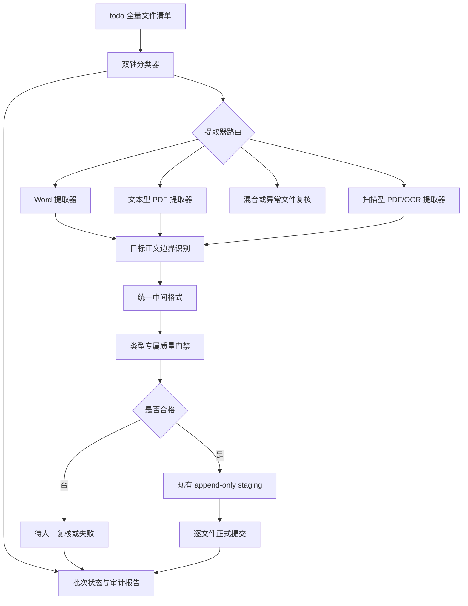

# 多格式法律语料摄取专项总设计

**状态：** 已批准  
**日期：** 2026-06-28  
**角色：** `architecture_or_strategy` 总体架构下的专项分卷
**上位设计：** [法规摄取总体架构](./2026-06-29-legal-ingestion-overall-architecture.md)
**入口决策：** [ADR-1：统一法规摄取入口与策略路由](./2026-06-29-unified-legal-ingestion-entry-adr.md)

## 1. 文档职责

本文定义处理 `法律文本/todo/` 全量法规的多格式专项范围、核心决策、组件边界和数据流，是总体架构入口下的专项总设计。

唯一 CLI、统一编排器、互斥输入、双轴独立策略注册、稳定结果语义和服务层兼容边界由上位总体架构与 ADR 负责；本文中的批次、路由和提交描述均是统一编排器内部的数据流，不构成第二个用户入口。

本文不重复专项规则，具体细节由以下文档唯一负责：

- [文件分类与提取器路由设计](./2026-06-28-legal-source-classification-and-extraction-design.md)
- [目标正文边界与统一中间格式设计](./2026-06-28-legal-content-boundary-and-intermediate-model-design.md)
- [质量门禁与批次状态设计](./2026-06-28-legal-ingestion-quality-gates-and-batch-state-design.md)
- [todo 法律语料评估基线](../reference_material/2026-06-28-todo-legal-corpus-assessment.md)

## 2. 背景

现有增量机制已经具备以下能力：

- 显式接收一份全新 `.doc/.docx` 法规；
- 在 staging 中生成标准化文本、结构化文档和 chunks；
- 对关键词索引和向量索引执行 append-only 追加；
- 在正式提交前检查 `document_id`、产物、manifest 和索引冲突；
- 提交失败时避免正式产物长期处于部分更新状态。

但现有机制的输入前提过窄：

- 只接受 `.doc/.docx`；
- 一次只能处理一份文件；
- 只以“标准化成功且 chunk 非空”判断语料生成成功；
- 不区分文本型 PDF 与扫描型 PDF；
- 不识别复合发布材料、正文边界和排除内容；
- 不能发现页码域、条文重复、附件串入正文等语义质量问题。

因此，下一阶段不是替换 append-only 提交机制，而是在其上游增加可审计的多格式摄取层。

## 3. 设计目标

1. 发现并分类 `法律文本/todo/` 下的全部候选文件。
2. 根据文件真实特征选择 Word、文本型 PDF 或扫描型 PDF 提取器。
3. 从复合文件中只识别和保留目标法规正文。
4. 不把附件、评分表和文书模板写入任何生成语料。
5. 统一不同提取器的输出，使现有法律结构解析与切块链路可以复用或演进。
6. 在 append-only 提交前执行类型专属质量门禁。
7. 支持批次发现和状态汇总，但保持逐文件原子提交与失败隔离。
8. 为每份真实文件留下可追溯的分类、提取、排除和验收结果。

## 4. 非目标

- 不在本设计中选择或安装具体 OCR 引擎。
- 不保存附件、评分表或文书模板的提取正文。
- 不修改或删除 `法律文本/` 下的原始文件。
- 不自动把文件从 `todo/` 移动到 `done/`。
- 不实现旧法规替换、删除、条文级 diff 或自动判断法律效力。
- 不要求 14 份文件组成一个全局原子事务。
- 不改变在线问答、会话或前端展示协议。

## 5. 核心决策

### 5.1 双轴分类

每份文件必须同时得到两类标签：

- 提取轴：Word、文本型 PDF、扫描型 PDF、混合或异常文件；
- 结构轴：纯法规正文、复合发布文件、正文后附排除内容、混合不确定结构。

扩展名只能作为候选信号，不能作为最终分类依据。

### 5.2 只保留目标法规正文

生成语料只包含目标法规标题、正文层级和条文内容。

以下内容不得进入 normalized、structured、chunks 或索引：

- 附件；
- 评分表；
- 文书模板；
- 印发信息；
- 与目标法规无关的封面和页面噪声。

原始源文件继续只读保留。提取报告可以记录排除范围、类型和原因，但不得复制排除正文。

### 5.3 先验收后提交

提取成功不等于语料合格。只有通过以下阶段的文件才允许调用现有 append-only 提交层：

1. 分类完成；
2. 文本提取完成；
3. 目标正文边界确定；
4. 统一中间格式合法；
5. 类型专属质量门禁通过；
6. 必要的人工复核完成。

### 5.4 批次发现、逐文件提交

批次层负责发现、排序、状态汇总和报告，不直接拥有跨文件事务。

每份文件独立进入 staging、质量验收和正式提交。单份失败不得污染已通过文件，也不得阻止其他文件继续完成提取和验收。

## 6. 总体架构

## 7. 组件职责

### 7.1 文件清单器

- 递归发现 `todo/` 下的候选文件；
- 忽略 `.DS_Store` 等非业务文件；
- 记录相对路径、文件大小、扩展名和内容摘要；
- 生成稳定的批次输入清单；
- 不移动或修改源文件。

### 7.2 双轴分类器

- 验证真实文件类型；
- 检测 PDF 文本层、空页比例和页面图像特征；
- 识别复合发布、纯正文和正文后附排除内容的结构信号；
- 分类证据不足时输出“不确定”，禁止猜测为可自动提交类型。

### 7.3 提取器路由

- 为不同来源产生统一的页面或文本块输出；
- 保留必要的位置标识，供正文边界和质量核验使用；
- 不负责判断条文是否连续，也不负责正式提交。

### 7.4 正文边界识别器

- 定位目标法规标题；
- 区分发布说明、修订依据、法规正文和排除内容；
- 只把目标正文送入统一中间格式；
- 边界冲突时进入人工复核。

### 7.5 统一中间格式

- 隔离来源格式与法律结构解析；
- 表达正文块、位置、目标标题、版本元数据和排除范围；
- 明确禁止携带被排除内容的正文；
- 为结构解析、质量门禁和审计提供稳定契约。

### 7.6 质量门禁

- 执行通用及类型专属验证；
- 区分可自动通过、待人工复核和失败；
- 生成机器可读质量结果；
- 任何硬门禁失败都不得调用正式提交。

### 7.7 批次协调器

- 维护每份文件的独立状态；
- 汇总成功、待复核和失败原因；
- 只调度通过门禁的文件进入现有增量机制；
- 不替代现有单文件提交事务。

## 8. 与现有机制的集成边界

### 8.1 保留

- `document_id` 冲突预检；
- staging 隔离；
- normalized、structured、chunks 生成物边界；
- 关键词索引和向量索引追加；
- 正式产物回滚；
- manifest 最后写入。

### 8.2 扩展

- `CorpusDocument` 的来源格式表达；
- `normalize_document` 之前的文件分类和提取器路由；
- `ParsedDocument` 之前的正文边界和统一中间格式；
- `generate_new_corpus_artifacts` 之前的质量门禁；
- manifest 或批次报告中的提取和质量审计字段。

### 8.3 不直接复用

- 仅凭文件后缀接受输入；
- 只调用 `/usr/bin/textutil` 的单一路径；
- chunk 非空即判定成功；
- 将最后一条之后所有文本并入最后一条；
- 依赖目录移动表达处理状态。

## 9. 状态原则

最小状态集合由质量与批次专项设计定义，但必须满足：

- 未分类文件不能提取；
- 分类不确定文件不能自动提交；
- 边界不确定文件不能生成正式 chunks；
- 质量未通过文件不能进入 append-only commit；
- 已提交状态只能由现有正式提交成功结果产生；
- `todo/` 与 `done/` 目录位置不能替代 manifest 或批次状态。

## 10. 数据与审计原则

每份文件至少可以追溯：

- 来源相对路径和内容摘要；
- 提取分类与结构分类；
- 分类证据；
- 使用的提取器和版本；
- 目标正文范围；
- 排除范围、类型和原因；
- 质量门禁结果；
- 人工复核结果；
- 是否进入正式提交及对应 run 标识。

审计信息不得包含被排除附件的正文副本。

## 11. 环境与依赖边界

- 所有代码和验证继续在 conda 环境 `fire` 中执行。
- 当前设计阶段无需新增依赖。
- 后端包管理工具必须在后续实施计划中明确。
- OCR 引擎、中文语言资源和 PDF 图像预处理依赖必须先查阅最新官方文档，再向用户列明用途、安装位置和包管理工具。
- 本设计不涉及前端依赖或前端包管理工具。

## 12. 验收原则

总体方案完成必须同时满足：

1. `todo/` 中 14 份真实文件均有明确分类和处理状态；
2. 3 种当前存在的来源格式均有合法路由；
3. 目标法规正文与排除内容不存在混写；
4. 类型专属质量门禁可以阻止已知污染场景；
5. 真实文件测试不得因旧路径而静默跳过；
6. 只有通过门禁的文件才能调用现有 append-only 提交；
7. 单份失败不污染正式产物，也不抹去其他文件的独立结果；
8. 所有结果可以从批次报告回溯到原始文件和质量证据。

## 13. 文档层级与后续文档

本文与分类和提取、正文边界和中间格式、质量门禁和批次状态三篇设计共同组成多格式专项分卷。专项分卷负责各自规则，不得覆盖总体架构或 ADR；若出现跨组件冲突，以总体架构和已接受 ADR 为准。

实施工作以[多格式法律语料摄取实施计划](../project_or_workflow/2026-06-28-multi-format-legal-corpus-ingestion-implementation.md)及其分卷为执行入口。实施计划必须：

- 使用 SDD 与 TDD；
- 按 Phase/Task 明确输入检查；
- 显式声明每阶段是否需要依赖；
- 明确后端、前端和其他环境的包管理工具；
- 为每条命令写明执行意图和预期输出；
- 保持每份文档不超过 500 行。
