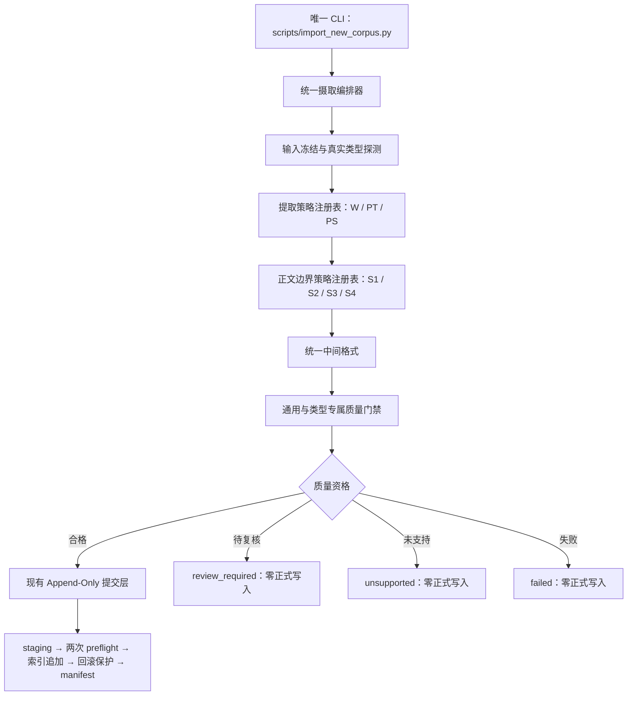

# 法规摄取总体架构

**状态：** 已批准
**日期：** 2026-06-29
**角色：** `architecture_or_strategy`
**适用范围：** 法规文件从用户输入到 Append-Only 正式提交的长期架构、入口契约与组件边界

## 1. 文档职责

本文是法规摄取架构设计层的总入口，负责定义：

- 唯一用户 CLI 与统一服务入口；
- 单文件和显式批次的输入边界；
- 提取轴与正文边界轴的独立策略注册；
- 统一编排顺序和状态语义；
- 质量资格与现有 Append-Only 提交层的边界；
- 现有 `run_incremental_import()` 的兼容处理；
- 总体设计、专项分卷、ADR、能力路线图和里程碑执行计划之间的权威关系。

本文不定义具体格式探测阈值、正文边界算法、质量门禁明细或实施步骤。这些内容由专项设计与里程碑执行计划分别负责。

## 2. 背景与问题

当前 `scripts/import_new_corpus.py` 是单文件 DOC/DOCX 增量导入入口，直接调用 `run_incremental_import()`，后者完成来源解析、标准化、结构解析、切块和 Append-Only 提交。

现有链路已经具备 staging、两次 preflight、索引追加、回滚和 manifest 最后写入等可靠提交能力，但上游仍存在三类架构问题：

1. 输入接收、格式处理、正文识别、质量判定和正式提交耦合在同一旧流程中。
2. 若按 W-S1、W-S2、PT-S1 等分类组合新增脚本，入口和测试矩阵会持续膨胀。
3. 若保留旧直通入口，新质量门禁可以被绕过，形成两套提交资格。

因此，本架构不新增 W-S1 专用入口，而是收紧现有入口，使所有法规摄取共享同一编排和提交资格。

## 3. 架构目标

1. 用户只需学习并维护一个法规增量摄取 CLI。
2. 提取方式与正文结构分别扩展，避免分类组合数量相乘。
3. 未支持、待复核和执行失败具有稳定且不同的语义。
4. 所有正式写入只能来自统一编排器签发的质量资格。
5. 复用现有 Append-Only 事务能力，不重写已验证的提交机制。
6. 单文件和批次共用逐文件处理链路，批次不引入全局事务。
7. 新里程碑按缺失能力编写计划，策略组合只补集成验收。

## 4. 非目标

- 不在本文选择或安装 Word、PDF、OCR 具体依赖。
- 不在本文实现 W、PT、PS 或 S1—S4 的具体算法。
- 不支持按目录隐式扫描并直接提交。
- 不建立多文件全局原子事务。
- 不实现旧法规覆盖、删除、版本替换或条文级 diff。
- 不改变在线问答、检索或前端协议。
- 不把全部未来策略提前列为已实现能力。

## 5. 总体结构

唯一 CLI 只负责解析参数、加载配置、调用编排器和把结果映射为稳定输出；不得包含格式判断、正文截断、质量门禁或提交事务。

## 6. 输入契约

### 6.1 单文件输入

继续兼容现有位置参数和 `--source` 语法。两种语法都表达“显式指定一个来源文件”，不得同时传入，也不得重复传入多个来源。

语法兼容不等于行为兼容。旧命令仍可执行，但来源必须经过完整的新编排链路；未取得质量资格时不得继续按旧逻辑提交。

### 6.2 显式批次输入

批次输入必须使用独立的显式批次参数，并与单文件参数互斥。批次输入引用一个可审计清单，而不是把目录扫描隐式解释为提交授权。

批次开始时冻结每个文件的相对路径、大小和 SHA-256。运行期间新出现的文件进入下一批次，不并入当前清单。

### 6.3 输入互斥不变量

- 单文件和显式批次恰好选择一种；
- 未提供输入、同时提供两种输入或重复指定单文件均属于参数错误；
- 参数错误发生在加载模型、创建 staging 或写入正式数据之前；
- 目录只可作为未来“生成候选清单”的来源，不能直接等同于批次提交。

## 7. 统一摄取编排器

统一服务入口记为 `run_legal_ingestion()`。名称可以在实施设计中按仓库命名规范调整，但职责不得拆散为多个分类组合入口。

编排顺序固定为：

1. 解析并冻结显式输入；
2. 校验源文件身份与摘要；
3. 探测真实格式并形成提取轴分类；
4. 从提取策略注册表选择策略并产生候选证据；
5. 形成结构轴分类；
6. 从正文边界策略注册表选择策略；
7. 生成只含目标正文的统一中间格式；
8. 生成 normalized、structured、chunks 候选产物；
9. 执行通用及类型专属质量门禁；
10. 生成质量资格或稳定的非提交结果；
11. 仅把合格结果交给现有 Append-Only 提交层；
12. 汇总逐文件结果和批次状态。

任何调用正式提交层的路径都必须经过同一编排顺序，测试、服务函数和 CLI 不得创建旁路。

## 8. 双轴独立策略注册

### 8.1 提取策略

提取轴回答“如何从真实文件取得可审计的候选内容”：

- W：Word 提取策略；
- PT：文本型 PDF 提取策略；
- PS：扫描型 PDF/OCR 提取策略。

PX 是探测异常或混合结果，不是可自动注册并提交的提取策略。若无法可靠选择 W、PT 或 PS，结果进入 `review_required` 或 `unsupported`。

### 8.2 正文边界策略

结构轴回答“候选内容中的目标法规正文在哪里”：

- S1：纯正文边界策略；
- S2：复合发布边界策略；
- S3：正文后排除边界策略；
- S4：混合不确定结构策略。

S4 策略的默认职责是产生待复核结果，不得以宽松截断获得自动提交资格。

### 8.3 禁止组合策略

不得注册 `W-S1`、`PT-S1`、`W-S2` 等组合策略。编排器必须分别解析提取策略和正文边界策略，再把二者组合运行。

因此，新增 PT 只扩展提取轴，新增 S2 只扩展正文边界轴；已实现能力可以交叉复用，组合只承担集成验收。

## 9. 结果语义

统一编排结果至少区分：

| 结果 | 含义 | 是否允许正式写入 |
| --- | --- | --- |
| `committed` | 已取得质量资格并完成 Append-Only 提交 | 已完成 |
| `unsupported` | 系统尚未实现该来源或策略所需能力 | 否 |
| `review_required` | 系统已取得候选证据，但无法消除分类、边界或质量歧义 | 否 |
| `failed` | 参数之外的处理、质量契约或提交过程发生明确失败 | 否 |

`unsupported` 不是执行异常，不能伪装为 `failed`；`review_required` 不是“尽量提交”，必须保持零正式写入；`failed` 必须记录失败阶段、稳定错误码和是否可重试。

CLI 应为三类非提交结果提供稳定错误码和退出码。参数错误继续使用退出码 `2`，一般失败继续使用退出码 `1`；`unsupported` 与 `review_required` 使用彼此不同且不会与 `1/2` 冲突的退出码。具体数值一经实现即成为兼容契约。

专项门禁内部仍可使用 `pass`、`review_required`、`fail`；其中 `fail` 汇总到逐文件编排结果时映射为 `failed`。

## 10. 质量资格

质量资格是进入正式提交层的唯一许可证，不是“文本非空”或“chunk 非空”的别名。

资格至少绑定：

- 来源相对路径和 SHA-256；
- 提取轴与结构轴分类；
- 提取策略、边界策略和规则版本；
- 统一中间格式与三类候选产物摘要；
- 通用及类型专属门禁结果；
- 人工复核记录（如适用）；
- attempt 与编排 run 标识。

只有 `auto_passed`，或人工复核后重新运行机械门禁并达到 `review_passed`，才可生成提交资格。资格与源摘要或候选产物不一致时必须失效。

## 11. 与现有 Append-Only 提交层的边界

继续复用：

- `validate_append_only_preflight` 的提交前冲突检查；
- `data/.staging/` 的不可见候选产物；
- normalized、structured、chunks 的正式产物边界；
- 关键词索引和向量索引追加；
- 正式文件独占创建；
- 正式索引替换和回滚；
- manifest 最后写入。

必须收紧：

- 提交计划必须携带可验证的质量资格引用；
- 正式提交前再次核对来源摘要和候选产物摘要；
- 未支持、待复核和失败结果不得创建正式提交计划；
- Append-Only 层不再自行解释原始 Word/PDF 文件，也不自行判定正文质量。

本架构复用现有提交事务，不复用“DOC/DOCX 非空文本即可提交”的旧资格条件。

## 12. 现有服务接口的兼容边界

`scripts/import_new_corpus.py` 保留为唯一 CLI，不新增 `import_ws1_corpus.py` 或其他按类别命名的入口。

现有 `run_incremental_import()` 不得继续保留旧直通链路。它可以：

1. 作为兼容外观，完整委托 `run_legal_ingestion()`；或
2. 在所有调用方迁移后删除。

迁移期间若保留兼容外观，其输入、结果和异常必须来自统一编排器，不能自行执行 `normalize → parse → chunks → commit`。仓库内测试也必须通过统一编排器证明提交资格。

## 13. 批次与失败隔离

- 批次负责读取冻结清单、调度、状态汇总和报告；
- 每个文件拥有独立 attempt、门禁结论、staging 和提交结果；
- 提取与门禁可以独立运行，修改共享正式索引的提交必须串行；
- 单文件失败不阻止后续文件继续，也不回滚其他已提交文件；
- 批次不建立全局事务，不提供“全部成功才提交”语义；
- `completed_with_exceptions` 只表示调度结束，不表示能力里程碑完成。

## 14. 文档分层与权威边界

### 14.1 架构设计层

- 本文负责总体结构、入口契约、策略扩展方式和跨组件边界。
- [多格式法律语料摄取专项总设计](./2026-06-28-multi-format-legal-corpus-ingestion-design.md)负责 `todo` 多格式处理范围、数据流和组件职责。
- [分类与提取专项设计](./2026-06-28-legal-source-classification-and-extraction-design.md)负责真实格式探测、双轴分类证据和提取器共同契约。
- [正文边界与中间格式专项设计](./2026-06-28-legal-content-boundary-and-intermediate-model-design.md)负责目标正文边界、排除内容和中间格式不变量。
- [S3 正文后排除边界专项设计](./2026-07-04-s3-trailing-exclusion-boundary-design.md)负责 S3 尾部强信号、边界流程、排除类型和专属质量门禁。
- [质量门禁与批次状态专项设计](./2026-06-28-legal-ingestion-quality-gates-and-batch-state-design.md)负责门禁、状态机、提交资格和批次审计。
- [统一法规摄取入口 ADR](./2026-06-29-unified-legal-ingestion-entry-adr.md)记录唯一薄 CLI 决策的背景、备选方案和兼容性后果。

### 14.2 总体规划层

[法规摄取能力路线图](../project_or_workflow/2026-06-29-legal-ingestion-capability-roadmap.md)记录 W、PT、PS 与 S1—S4 的当前能力状态、依赖、里程碑顺序和计划入口。路线图回答“何时建设”，不得改写本文的长期架构或专项算法。

### 14.3 里程碑执行层

里程碑计划只定义本阶段新增能力、代码任务、TDD 步骤、真实验收和文档收尾。计划不得新增分类组合 CLI，也不得复制形成第二套策略接口。

同级专项设计发生冲突时，按各自职责边界判断；跨组件冲突以本文和已接受 ADR 为准。执行计划与设计冲突时，应先修订计划，不得用计划覆盖设计。

## 15. 依赖与实施边界

- 本设计阶段无需新增依赖，沿用 conda 环境 `fire`。
- 后端包管理工具必须由具体实施计划显式声明；所有安装和代码执行均在 `fire` 环境完成。
- PDF、OCR 或其他新能力在选型前必须查询最新官方文档。
- 未经用户确认，不得安装新依赖。
- 本文不涉及前端依赖或前端包管理工具。

## 16. 架构不变量

1. 仓库只有一个面向用户的法规增量摄取 CLI。
2. CLI 始终是薄入口，业务规则只存在于统一编排及其策略中。
3. 提取策略和正文边界策略独立注册，禁止组合策略。
4. 所有正式提交先取得质量资格。
5. `unsupported`、`review_required` 和 `failed` 均保持零正式写入。
6. `run_incremental_import()` 不得成为旧提交旁路。
7. 单文件和显式批次输入互斥。
8. 批次逐文件提交，不建立全局事务。
9. 新能力按策略规划，策略组合只做集成验收。
