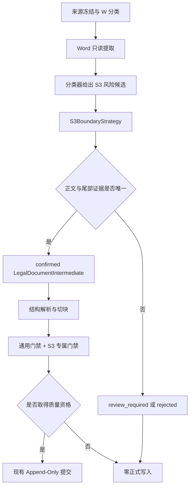

# S3 正文后排除边界专项设计

**状态：** 已批准并完成首个 W-S3 真实验收
**日期：** 2026-07-04
**角色：** `architecture_or_strategy` 正文边界专项下的细化设计
**适用范围：** 目标法规正文完整出现后，源文件尾部仍包含附件、评分表、考核表、文书模板或相关印发信息的 S3 内容结构
**上位设计：** [目标法规正文边界与统一中间格式专项设计](./2026-06-28-legal-content-boundary-and-intermediate-model-design.md)
**首个组合验收：** Linear“消防AI”项目的“W-S3 尾部排除内容”里程碑

## 1. 文档职责

本文负责细化 S3 正文后排除能力：

- 规定 S3 与 S1 尾部噪声、S4 混合不确定结构的边界；
- 定义正文结束位置、尾部候选位置和最终排除范围的判定顺序；
- 定义附件、评分表、考核表、文书模板和印发信息的组合信号；
- 定义 S3 如何生成 `LegalDocumentIntermediate`；
- 定义歧义、失败和零正式写入规则；
- 定义 S3 专属质量门禁与 W-S3 真实验收标准；
- 为 W-S3 实施和后续 PT/PS-S3 复用提供稳定设计输入。

本文不负责：

- Word、文本型 PDF 或扫描型 PDF 的提取算法；
- PDF/OCR 依赖选型；
- Append-Only 提交事务的重写；
- 人工复核工作台；
- 具体代码 Task、命令和提交批次；
- 为 W-S3 创建组合策略或第二个 CLI。

S3 是独立正文边界能力，W-S3 只是 W 提取策略与 S3 边界策略的首个组合验收。未来 PS-S3 必须复用同一 S3 语义，不得复制一套扫描件专用边界规则。

## 2. 当前状态与真实样本

### 2.1 能力状态

当前代码已实现并独立注册 `S3BoundaryStrategy`，统一编排器可按 `ContentClass.S3` 解析该策略。质量规则集已升级为 `legal-quality-v3`，S3 专属门禁、临时 Append-Only、失败隔离和正式索引验收均已通过。能力路线图中的 S3 与 W-S3 状态均为 `implemented`。

W-S3 首个真实验收已完成；这只证明 W 提取策略与 S3 边界策略的组合可用，不代表 PT、PS/OCR 或 PS-S3 已实现。

### 2.2 W-S3 真实文件

唯一冻结基线中的 W-S3 文件为：

`督察、处罚与监管/河北省消防救援机构执法过错责任追究规定.doc`

已确认事实：

| 项目 | 当前证据 |
| --- | --- |
| 提取分类 | `W` |
| 内容分类 | `S3` |
| 正式正文 | 第一条至第二十九条 |
| 正文终止条款 | 第二十九条规定施行时间及旧规定废止 |
| 正文后第一段材料 | 印发机关、印发日期、承办单位、经办信息和印数 |
| 后续材料 | 附件目录及 5 套行政执法监督文书模板 |
| 尾部噪声 | Word `PAGE \* MERGEFORMAT` 域 |
| 实施前错误 | 尾部材料被并入第二十九条，污染结构化条文和 chunks |
| 当前结果 | 29 条干净正文、34 个干净 chunks；尾部材料未进入可检索产物 |

旧探针产生的 37 个 chunks 已包含污染，不能作为 W-S3 的验收值。Task 6 已根据 confirmed S3 边界和 29 条结构化正文，把干净 chunk 数冻结为 34。

## 3. 设计目标与非目标

### 3.1 目标

1. 先确认唯一目标标题和完整连续正文，再判断正文后的排除内容。
2. 将正文结束位置固定为最后一个正式正文单元的结束位置。
3. 将正文后的实质性附件或模板材料分类为可审计但不保存内容的排除范围。
4. 保证印发信息、附件目录、模板正文和页码域不进入 normalized、structured、chunks、关键词索引或向量索引。
5. 任何不能唯一确定的正文结束或尾部起点都进入 `review_required`。
6. 保持 S1、S2、统一 CLI、质量资格和 Append-Only 行为兼容。

### 3.2 非目标

- 不因为实现 W-S3 而实现 PS-S3 或 OCR。
- 不把所有“最后一条之后还有文字”的文件都改判为 S3。
- 不依赖首次出现“附件”进行无条件截断。
- 不保存被排除内容的标题、摘要、正文、OCR 文本或表格内容。
- 不引入通用规则引擎或重写 S1、S2 策略。
- 不修改在线问答和前端协议。

## 4. S1、S3 与 S4 的边界

| 分类 | 正文后内容 | 自动处理 |
| --- | --- | --- |
| S1 | 仅空行、页码域、普通页脚或单段印发尾注 | 由 S1 现有尾部噪声规则处理 |
| S3 | 正文后存在连续的附件、评分表、考核表、文书模板等实质排除材料 | 证据完整时由 S3 自动确认 |
| S4 | 排除内容穿插正文、尾部又出现正式条文、多个尾部起点同样合理或材料类型无法解释 | `review_required`，零正式写入 |

印发信息和页码域本身不足以证明 S3。S3 至少需要一个“实质尾部强信号”；否则应保持 S1，或在分类与边界策略结论冲突时进入复核。

## 5. 架构决策

### 5.1 独立策略

实现采用独立 `S3BoundaryStrategy`，模块为：

`app/services/legal_s3_boundary.py`

它接收 W、PT 或 PS 提取策略未来产生的统一 `ExtractionResult`，输出 `LegalDocumentIntermediate`。首个里程碑只接入 W，不在策略名称或接口中写入 W。

策略注册表增加独立 `s3_strategy` 注入位置，统一编排器默认注册 S1、S2、S3。禁止：

- 在 S1 策略中加入 `mode="S3"`；
- 注册 `W-S3` 组合键；
- 新增 W-S3 专用 CLI；
- 让 S3 直接调用提交层。

### 5.2 有限复用

S3 可以复用 S1 已有的通用能力：

- 标题规范化；
- 正式条号识别和中文数字转换；
- 编、章、节、条、段正文单元构建；
- 页码域和普通印发尾注识别；
- 来源位置与摘要校验。

复用应通过无行为变化的公共辅助函数完成。不得让 S3 通过调用完整 S1 策略后再覆盖结果，因为这会混淆两类策略的职责和诊断信息。

## 6. 多信号尾部识别模型

### 6.1 正文锚点

S3 必须先满足以下正文条件：

1. 目标标题唯一，并与冻结基线或文件名候选可解释地对应；
2. 标题后存在第一条；
3. 条号从第一条连续递增；
4. 编、章、节和条文归属可以唯一解释；
5. 最后一个正式条文及其段落可以唯一确定；
6. 正文区域中不存在尾部材料穿插。

这些条件不满足时，不得尝试通过尾部关键词“挽救”边界。

### 6.2 实质尾部强信号

以下信号位于已确认正文之后时，可以形成 S3 强信号：

| 信号 | 含义 |
| --- | --- |
| `attachment_heading` | 独立的“附件”或带编号附件标题 |
| `attachment_index` | 附件标题之后连续列出多个表格、文书或式样 |
| `form_template_series` | 连续出现多个带编号的文书模板或式样标题 |
| `score_or_assessment_table` | 独立评分表、考核表标题及连续表格字段 |
| `template_field_sequence` | 姓名、单位、地址、审批意见、签名、日期等成组模板字段 |

单个普通词语、正文中的文书名称引用、带“附件”字样的完整句子都不是强信号。

### 6.3 辅助信号

辅助信号只能提高可信度，不能单独确认 S3：

- 最后一条后的连续空行；
- 印发机关、印发日期、承办单位、经办人、电话或印数；
- 抄送信息；
- Word 页码域；
- 页码或页脚；
- 正文结束后不再出现正式连续条号。

### 6.4 判定原则

自动确认 S3 必须同时满足：

1. 正文锚点完整；
2. 正文后至少存在一个实质尾部强信号；
3. 从候选尾部起点到文件末尾的所有非空块都能归入允许的尾部类型；
4. 尾部范围与任何正文单元不重叠；
5. 候选尾部起点之后不再出现正式法规条文；
6. 只有一个可解释的最早尾部起点。

## 7. 边界判定流程

S3 使用以下顺序，不使用“首次附件截断”：

1. 校验来源摘要、提取状态和块顺序；
2. 唯一确定目标标题；
3. 找到第一条并验证连续条号；
4. 确定最后一条及其所有正文段落；
5. 从正文结束后的文本块中寻找实质尾部强信号；
6. 向前吸收与强信号连续的印发信息、页脚和空白分隔，形成最早候选尾部起点；
7. 向后分类附件目录、模板、表格、页码域和其他允许尾部块；
8. 检查未知块、正文重入和多个候选起点；
9. 证据唯一时生成 confirmed S3 中间格式，否则生成空正文的 `review_required` 或 `rejected` 结果。

`boundary.end` 始终是最后一个正文单元的最后字符。`excluded_ranges` 的首个范围可以早于“附件”标题，用于覆盖正文与附件之间的印发信息，但不得早于 `boundary.end`。

## 8. 排除范围数据契约

继续复用现有 `ExcludedRange`，不新增被排除正文存储字段。一个 S3 文件可以产生多个互不重叠、按来源位置递增的范围：

| `kind` | 允许表示的内容 |
| --- | --- |
| `trailing_print_metadata` | 印发机关、日期、承办单位、经办信息和印数 |
| `attachment_index` | 附件或附表目录 |
| `form_template` | 文书模板、文书式样及填写字段 |
| `score_table` | 评分表、考核表及表格字段 |
| `word_page_field` | Word 页码域和相关页码噪声 |

每个范围只记录：

- 起止来源位置；
- 稳定 `kind`；
- 不包含排除正文的判定原因码。

`diagnostics`、质量报告和批次报告只能记录范围数量、类型、位置引用和原因码，不得复制范围内文本。运行时质量门禁可以读取本次内存提取块核验污染，但不得把这些文本写入报告。

## 9. 数据流

分类器只负责把文件路由到 S3 候选策略，不证明正文边界。最终提交资格必须来自 S3 策略输出和质量门禁，不得只相信分类器中的附件关键词。

## 10. 歧义、失败与安全停止

| 情形 | 结果 | 建议原因码 |
| --- | --- | --- |
| 标题或第一条无法唯一确定 | `review_required` | `s3_target_body_ambiguous` |
| 条号不连续 | `review_required` | `s3_article_sequence_broken` |
| 没有实质尾部强信号 | `review_required` | `s3_tail_signal_missing` |
| 存在多个合理尾部起点 | `review_required` | `s3_tail_start_ambiguous` |
| 尾部含无法分类的非空块 | `review_required` | `s3_unclassified_tail_block` |
| 尾部起点后又出现正式条文 | `review_required`，按 S4 处理 | `s3_article_after_tail_start` |
| 排除范围与正文重叠 | `failed` | `s3_exclusion_overlaps_body` |
| 来源摘要变化或块顺序损坏 | `failed` | `source_changed` 或 `block_order_invalid` |

`review_required` 表示证据不足，需要人工判断；`failed` 表示机械契约已经被违反。两者都不得生成提交资格或正式产物。

## 11. S3 专属质量门禁

通用门禁继续检查来源身份、正文确认、条号、正文纯净、排除隔离、跨层一致和 chunk 覆盖。S3 额外增加：

| 门禁 | 通过标准 |
| --- | --- |
| `s3_tail_exclusion_presence` | 至少存在一个实质尾部范围，且 `kind` 属于允许集合 |
| `s3_tail_position` | 所有排除范围严格位于 `boundary.end` 之后，按来源位置递增且互不重叠 |
| `s3_tail_coverage` | 正文后的所有非空块均为已分类排除内容或允许噪声，不存在未解释文本 |
| `s3_output_purity` | 排除范围内文本未进入 body units、parsed articles 或 chunks |

S3 门禁改变了质量规则语义，因此实现已将规则集从 `legal-quality-v2` 升级到 `legal-quality-v3`，并同步 S1、S2 回归断言。版本升级不表示 S1、S2 算法变化。

门禁报告只保留数量、类型、位置和原因码，不保留排除正文。

## 12. 测试与真实验收

### 12.1 TDD 顺序

实施必须先编写失败测试，再编写策略代码：

1. S3 策略注册与默认 `unsupported` 迁移测试；
2. 正文锚点和尾部多信号单元测试；
3. 歧义、S4 降级和摘要变化测试；
4. 中间格式排除范围不变量测试；
5. S3 专属质量门禁测试；
6. 真实 W-S3 文件集成测试；
7. 批次 dry-run、临时提交和正式索引验收；
8. W-S1、W-S2 完整回归。

### 12.2 必须覆盖的合成用例

- 正文中引用“审批表”但正文后无附件，不得误截断；
- “附件”出现在目标标题之前，不得触发尾部；
- 印发信息位于附件标题之前，应从印发信息起排除；
- 没有“附件”标题但存在连续文书模板，应能形成 S3 候选；
- 尾部标记后再次出现正式条文，应进入 S4/复核；
- 最后一条后出现无法分类文本，应进入复核；
- 排除范围与正文重叠，质量门禁必须失败；
- 排除内容泄漏到任一 chunk，质量门禁必须失败。

### 12.3 W-S3 真实验收

真实文件必须满足：

1. 仍从唯一 `todo_baseline.json` 派生 W-S3 范围，不建立第二份清单；
2. 只选择 1 份 W-S3 文件；
3. `boundary.status=confirmed`；
4. parsed articles 恰好为第一条至第二十九条；
5. 第二十九条只包含正式终止条款，不包含印发信息、附件目录、模板或页码域；
6. 所有 chunks 的 `content_class` 为 `S3`，来源范围位于 confirmed 正文内；
7. normalized、structured、chunks 和质量报告不保存排除正文；
8. dry-run 为 `selected=1`、`auto_passed=1`，其他非提交计数为 0；
9. 临时目录提交、失败隔离和回滚测试通过；
10. 正式提交后 manifest、语料文件、关键词索引、向量映射和 FAISS 数量一致；
11. 标题检索能够命中目标文档；只存在于尾部模板、正文中未出现的代表性文本不得命中该文档；
12. W-S1 与 W-S2 真实回归保持通过。

正式提交前必须先根据干净正文冻结预期 chunk 数。旧探针的 37 个污染 chunks 不得直接沿用。

## 13. 依赖、环境与包管理

- 本设计和 W-S3 实施均未新增依赖，沿用现有环境。
- 后端运行环境为 conda 环境 `fire`；如未来发现确需安装依赖，必须先单独报备依赖、用途、安装位置和包管理工具。
- 本里程碑不涉及前端，不使用 npm、pnpm 或 yarn。
- 不涉及 PDF/OCR，因此不得顺带安装 OCR、图像处理或 PDF 解析依赖。
- 所有 Python、pytest、脚本和服务验证必须通过 `conda run -n fire ...` 执行。

## 14. 实施计划与完成结果

W-S3 里程碑已按 [实施计划入口](../project_or_workflow/2026-07-04-s3-boundary-and-w-s3-acceptance-implementation.md) 的“总览 + 2 个分卷”完成 Task 1—8：

| 文档 | 职责 |
| --- | --- |
| W-S3 实施计划总览 | 范围、依赖、全局门禁、Task 导航、提交策略和最终验收；已完成 |
| 分卷一：策略与质量能力 | 冻结范围、公共辅助函数无行为重构、S3 策略、注册接入、S3 门禁与规则版本升级；Task 1—5 已完成 |
| 分卷二：真实验收与正式提交 | W-S3 dry-run、临时提交、回滚、正式导入、检索验收和文档收尾；Task 6—8 已完成 |

完成结果：

1. 唯一 W-S3 文件形成 29 条正文、34 个干净 chunks，四项 S3 专属门禁全部 PASS；
2. 正式批次 `c132d0f3-aa52-40cc-a1c8-7e26cb0209e1` 为 `selected=1`、`committed=1`、`failed=0`；
3. 正式索引达到 20 份文档、876 个关键词 chunks、876 个 FAISS 向量，manifest 共 14 条；
4. 仓库完整回归为 471 项通过，1 条既有 pytest mark 警告；
5. Linear 里程碑正文已标记 `implemented`，路线图和 README 已同步。

原计划保留逐 Task 的依赖、包管理工具、阶段输入检查、预期输出、命令意图和 Git commit 策略，作为本次实现的可追溯执行记录。

## 15. 权威边界

- [法规摄取总体架构](./2026-06-29-legal-ingestion-overall-architecture.md)负责唯一入口、独立策略注册和提交边界。
- [正文边界与中间格式专项设计](./2026-06-28-legal-content-boundary-and-intermediate-model-design.md)负责 S1—S4 的通用边界原则和中间格式不变量。
- 本文负责 S3 的具体信号、判定流程、排除类型和专属门禁。
- [质量门禁与批次状态专项设计](./2026-06-28-legal-ingestion-quality-gates-and-batch-state-design.md)负责通用门禁、资格和批次状态。
- [todo 法律文本评估基线](../reference_material/2026-06-28-todo-legal-corpus-assessment.md)负责真实文件事实，不制定长期算法。
- W-S3 实施计划把本文转换为已完成的可执行 Task，不得反向改写本文的边界语义。

## 16. 设计结论

S3 的安全实现不能等价为“遇到附件就截断”。系统必须先确认唯一且完整的法规正文，再以至少一个实质尾部强信号和一组辅助信号证明正文后的材料属于可排除区域。

W-S3 首个验收文件已得到 29 条干净正文和 34 个干净 chunks；印发信息、附件目录、5 套文书模板和页码域只留下来源范围、类型和原因，未进入任何可检索产物。后续任何边界歧义仍必须在 Append-Only 正式提交前停止。
