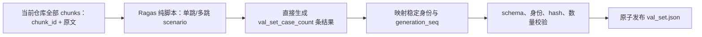

# 分卷二：val_set 生成与冻结

> **文档类型**：专项架构设计分卷
> **日期**：2026-08-09
> **版本**：v2.0
> **状态**：Under Review

## 0. 卷册导航与本卷边界

- [返回设计总卷](../../新评测系统设计总卷.md)：确认当前只实施 evaluation，并按分卷导航继续读取。
- [分卷一：评测执行与报告架构](./2026-07-23-evaluation-optimization-loop-architecture-design.md)：读取正式 `val_set.json` 的消费方式。
- 当前分卷：独占“当前仓库全部 chunks → Ragas 纯脚本生成目标数量结果 → 校验 → 正式 `val_set.json`”。
- [分卷三：Metric 与评分契约](./2026-07-27-ragas-response-reference-rubric-judge-design.md)：读取正式 val case 进入评分后的契约。

本卷只产生正式 `val_set.json`，不安排评测运行，也不定义评分配置、运行状态或输出文件。

## 1. 决策结论

本文设计 Ragas 的纯脚本生成用途：一次程序运行基于当前仓库全部 chunks，直接生成 `val_set_case_count` 条单跳或多跳 Query、参考答案及其来源 chunk 身份，然后执行契约校验、冻结并发布正式 `val_set.json`。

Ragas 行为与预计 import 面依据 [pre-chunked data 官方文档](https://docs.ragas.io/en/stable/howtos/customizations/testgenerator/prechunked_data/) 和 `0.4.3` 官方源码；`ragas==0.4.3` 与 `langchain-community==0.4.1` 已在项目依赖中固定。

## 2. 单一事实来源

本卷是 `val_set.json` 字段、纯脚本生成、校验、稳定身份和发布规则的唯一事实来源。总卷与其他分卷只引用 `val_set_id`、`content_hash` 和 val case，不复制本卷的字段表或生成规则；描述冲突时以本卷为准。

## 3. 生成输入边界

- 当前仓库全部 chunks 构成唯一生成输入集合。其现有物理来源为 `Settings.data_dir / "chunks"`：`Settings.data_dir` 默认是 `data`，脚本按文件名顺序读取该目录下全部 `*.jsonl` 的所有 chunk 记录，与现有 `scripts/build_index.py::load_chunks` 保持一致。
- 接入采用 Ragas `Node` / `KnowledgeGraph` 路径：当前仓库每个 chunk 直接成为一个 CHUNK Node，Node 同时携带原文与稳定 `chunk_id`。
- 不重新读取整篇文章，不重新切分、合并或改写 chunk 文本，也不按 `document_id` 聚合。
- Ragas 可以提取属性、建立 chunk 关系，并在 scenario 层选择一个或多个 chunks；这些操作不得改变 chunk 的物理边界。
- 不读取或复用旧评测系统的 Dataset、Query 或字段。
- 禁止把已有 chunks 包装成 LangChain `Document` 输入；不得通过文本反查自建 `chunk_id` 映射。

## 4. 生成结果契约

一次 Ragas 脚本生成必须保存以下结果信息：

| 字段 | 含义 | Source |
| --- | --- | --- |
| `query` | Ragas 生成的自足 Query | Ragas `0.4.3` 生成结果 |
| `reference_answer` | 与 Query 同次生成的参考答案 | Ragas `0.4.3` 生成结果 |
| `generation_type` | 单跳或多跳 | Ragas `0.4.3` synthesizer 类型 |
| `source_chunk_ids` | 本次 scenario 实际使用的稳定 `chunk_id` | Fire 当前仓库 chunk 身份 |
| `generation_seq` | 本次纯脚本生成结果中的全局稳定序号，仅用于固定输出顺序 | Fire 生成契约 |

`source_chunk_ids` 必须从 scenario 使用的 Node 属性直接读取，不能从 `reference_contexts` 文本反推；相同文本可以对应不同 `chunk_id`，必须保持不同身份。

## 5. 纯脚本生成与发布流程

## 6. 单跳与多跳语义

`generation_type` 保留为 Ragas 脚本生成样本时使用的单跳或多跳生成类型。它不表达运行批次、结果阶段或排序。单跳结果可对应一个 scenario 来源 Node，多跳结果可对应多个 scenario 来源 Nodes；`source_chunk_ids` 均必须直接从这些 Node 属性读取。

## 7. relevance ground truth 业务假设

脚本把 `source_chunk_ids` 对应的 chunk 快照直接写入 `relevance_ground_truth`，并把该集合作为正式、完整 \(G_q\) 冻结。这是 Fire 为当前评测协议明确接受的业务假设，不是 Ragas 对“全部相关 chunks 已被找齐”的自动证明。Ragas 不额外扫描全部 chunks 来证明召回完整性，Fire 也不在本流程增设自动或人工补齐步骤。

因此，Precision、Recall、Accuracy、MAP 和 MRR 只能相对该协议假设下的 \(G_q\) 解读。如果 scenario 未覆盖某些实际相关 chunks，这些指标会产生系统性偏差；报告和实施验收不得把这一协议假设改写为 Ragas 工具能力。

## 8. Ragas 默认生成配置

除适配层映射的 Ragas SDK `testset_size` API 参数外，Ragas `0.4.3` 已提供默认值的生成参数均采用上游默认，不另行自定义：

| 配置项 | 已确定值 | Source |
| --- | --- | --- |
| pre-chunked transforms | `generate_with_chunks` 对应的默认 transforms | Ragas `0.4.3` pre-chunked 实现 |
| query distribution | 可用的 `SingleHopSpecificQuerySynthesizer`、`MultiHopAbstractQuerySynthesizer`、`MultiHopSpecificQuerySynthesizer` 等权 | Ragas `0.4.3` 默认 query distribution |
| persona 数量 | `num_personas=3` | Ragas `0.4.3` 默认参数 |
| 批处理与执行 | `batch_size=None`、`return_executor=False` | Ragas `0.4.3` 默认参数 |
| 调试与异常 | `with_debugging_logs=False`、`raise_exceptions=True` | Ragas `0.4.3` 默认参数 |
| `RunConfig` | `timeout=180`、`max_retries=10`、`max_wait=60`、`max_workers=16`、`log_tenacity=False`、`seed=42` | Ragas `0.4.3` 默认参数 |
| `llm_factory` 模型参数 | `temperature=0.01`、`top_p=0.1`、`max_tokens=1024` | Ragas `0.4.3` 默认参数 |
| Query 风格与长度 | 沿用各 synthesizer 上游默认 | Ragas `0.4.3` synthesizer 默认 |

Fire 业务与 JSON 契约使用 `val_set_case_count=6` 表示一次纯脚本运行应直接生成、校验并冻结的 case 数。Ragas SDK 的 `testset_size` 不是 Fire 字段；适配层只在外部 API 调用时传入 `testset_size=val_set_case_count`。生成模型连接复用旧评测 LLM generator 的 `.env.example` 配置：`WS_RAG_QUESTION_GENERATOR_API_KEY`、`WS_RAG_QUESTION_GENERATOR_BASE_URL`、`WS_RAG_QUESTION_GENERATOR_MODEL`；不得误用 `CHAT_*` 或 Judge 配置。

## 9. `chunk_id` 传递方案

已选择 Ragas `Node` / `KnowledgeGraph` 方案，流程固定为：

1. 读取当前仓库全部 chunks，为每个 chunk 构造类型为 CHUNK 的 Ragas Node，并把原文与稳定 `chunk_id` 写入 Node 属性。
2. 用这些 Nodes 组装 `KnowledgeGraph`，应用 Ragas `0.4.3` pre-chunked 默认 transforms。
3. `TestsetGenerator` 基于该图生成 scenario、Query 与参考答案结果。
4. 在 scenario 节点仍可访问时，从节点属性读取 `chunk_id`，写入 `source_chunk_ids`。

**Rejected alternative — LangChain `Document.metadata`**：不采用。该方案需要把已有 chunks 二次包装为 LangChain `Document`，扩大 Fire 对 LangChain 业务 API 的直接耦合，且 metadata 是否全程保留仍需真实调用证明；Node 方案能在 Ragas 自身身份模型内直接携带 `chunk_id`。文本反查映射同样禁止，因为相同文本可能属于不同 chunks。

## 10. `val_set.json` 冻结契约

默认只生成一份 `val_set.json`，初始 `schema_version` 为 `1.0.0`。内容范围参考上游 evaluation quickstart 的“测什么”，不继承其字段名、SDK、Agent 会话或工具轨迹。

| 层级 | 字段 | 已确定含义 | Source |
| --- | --- | --- | --- |
| 顶层 | `schema_version` | 初始固定为 `1.0.0` | 用户决策；机械生成 |
| 顶层 | `val_set_id` | `val_<content_hash digest 前12位>`，不人工命名 | 用户决策；仓库 canonical JSON 与 `doc_<12hex>` 身份先例 |
| 顶层 | `frozen_at` | 冻结时间 | 用户决策；机械生成 |
| 顶层 | `content_hash` | 对规范化 `cases` 内容计算的集合哈希 | 用户决策；机械生成 |
| 顶层 | `val_set_case_count` | 固定为 `6`；本次纯脚本直接生成、校验并冻结的 case 数 | 用户决策 |
| 顶层 | `cases` | 冻结 case 数组 | 用户决策；上游模板内容范围 |
| case | `case_id` | 从该 case 规范化内容哈希机械生成的稳定 ID | 用户决策；机械生成 |
| case | `query` | Ragas 本次脚本生成的 Query | Ragas 生成结果 |
| case | `reference_answer` | 与 Query 同次脚本生成的参考答案 | Ragas 生成结果 |
| case | `generation_type` | 单跳或多跳 | Ragas 生成结果 |
| case | `generation_seq` | 本次纯脚本生成结果中的全局稳定序号，仅固定 `cases` 输出顺序 | 用户决策 |
| case | `relevance_ground_truth` | `source_chunk_ids` 对应的 chunk 快照数组；每项至少保存稳定 `chunk_id` 与原文 `text`；同一数组内 `chunk_id` 唯一，且是当前仓库全部 chunks 的子集。该集合按第 7 节的 Fire 业务假设作为正式、完整 \(G_q\) | 用户决策；Ragas 生成结果 |

`val_set_id` 与 `content_hash` 按既有稳定身份规范机械生成：

1. 从待冻结 payload 排除 `val_set_id`、`content_hash`/`fingerprint`、`frozen_at` 等派生或易变字段。
2. 使用 UTF-8、key 排序、紧凑分隔符和不转义非 ASCII 字符的 canonical JSON。
3. 对 canonical payload 计算 SHA-256；完整值保存为 `content_hash=sha256:<64hex>`。
4. 使用同一 digest 前 12 位生成 `val_set_id=val_<12hex>`。

该规则沿用 [`scripts/eval_ws_rag/dataset_models.py`](../../scripts/eval_ws_rag/dataset_models.py) 的 canonical JSON/SHA-256 fingerprint 规范，并沿用 [`app/services/corpus_ingestor.py`](../../app/services/corpus_ingestor.py) 的 `<类型前缀>_<digest前12位>` 稳定 ID 形态；不增加 namespace、release、revision 或用途 alias。

## 11. 生成数量与文件一致性

- 一次纯脚本运行直接生成 `val_set_case_count=6` 条结果，不建立中间结果类型或另一套计数语义。
- `cases` 必须按 `generation_seq` 的全局稳定顺序写出；`generation_seq` 不承载其他业务语义。
- 当前仓库 chunks 为空时 hard fail，且不得创建、截断或替换正式文件。
- `chunk_id` 重复时 hard fail；相同文本但 `chunk_id` 不同是合法输入，保持不同 Node 身份。
- Ragas 生成失败时不发布部分结果，并保留旧 `val_set.json` 不变。
- 发布顺序固定为：在正式文件同目录创建临时文件，写入、flush 并 fsync；完成 schema、稳定 ID、内容 hash 和 `len(cases) == val_set_case_count` 校验后同目录 replace；最后 fsync 父目录。不得保留含义重复的顶层 `case_count`。
- 临时文件创建、写入、flush 或 fsync 失败时不执行 replace，旧正式文件保持不变；校验失败同样不得 replace。合法临时文件的 replace 失败时，旧正式文件保持不变；若随后临时文件清理失败，在该 replace 失败码之外追加清理失败码。replace 已成功但父目录 fsync 失败时，发布可见性已经改变，只能报告持久性未确认，不能声称旧正式文件保持不变，也不得错误归类为 replace 失败。
- 以上生成与发布错误的稳定 `code`、选择优先级与尚未定义边界由[分卷三第 9 节](./2026-07-27-ragas-response-reference-rubric-judge-design.md#9-稳定错误码与处理责任)统一定义；本卷不复制错误码值域。

## 12. 依赖、embedding 与 import 边界

纯脚本生成固定使用 `ragas==0.4.3` 与 `langchain-community==0.4.1`。Fire 只通过 Ragas 的公开接口构造生成链，不在业务代码中导入 LangChain 类型：

- `ragas.testset.synthesizers.generate.TestsetGenerator`
- Ragas `Node` 与 `KnowledgeGraph` 的 `0.4.3` 公开导出
- `ragas.llms.llm_factory`
- `ragas.embeddings.HuggingFaceEmbeddings`
- `ragas.testset.synthesizers.SingleHopSpecificQuerySynthesizer`
- `ragas.testset.synthesizers.MultiHopAbstractQuerySynthesizer`
- `ragas.testset.synthesizers.MultiHopSpecificQuerySynthesizer`

Ragas embedding 必须与现有检索 embedding 保持同一配置语义：

- `model` 取当前 `EMBEDDING_MODEL_NAME`。
- `device`、`batch_size` 取现有 `Settings` 对应值。
- `normalize_embeddings=True`，不得改用未归一化向量。
- `max_seq_length` 非空时，必须应用到 `HuggingFaceEmbeddings` 持有的底层 `SentenceTransformer`；具体属性路径随最终固定的 Ragas 版本在实施时验证。
- 不得改用其他 embedding 实现，也不得为 Ragas 另选 embedding 模型或另建一套配置。

Node 方案不能消除 Ragas 的传递依赖，但不得因此把 LangChain `Document`、loader、splitter 或其他 LangChain 业务接口带入本模块。当前只验证了公开 import、Node/KnowledgeGraph 的 `chunk_id` 往返与 API 形状；真实脚本生成与正式文件发布仍待实施验证。

## 13. 后续实施验收

- 验证 Ragas `0.4.3` Node/KnowledgeGraph 链能在真实纯脚本生成中完整保留稳定 `chunk_id`。
- 执行一次真实纯脚本生成，确认直接得到 `val_set_case_count=6` 条 Query、参考答案与 `source_chunk_ids`。
- 验证 `generation_type` 只表示单跳/多跳生成类型，`generation_seq` 只固定本次结果的全局输出顺序。
- 验证 `source_chunk_ids` 对应 chunks 被原样冻结为正式、完整 \(G_q\)，并在报告与验收中保留“Fire 业务假设，非 Ragas 完整性证明”的限制。
- 验证同目录临时文件的 write/flush/fsync、校验、replace、父目录 fsync 顺序；验证 replace 前失败或 replace 失败时旧 `val_set.json` 保持不变，replace 成功后的父目录 fsync 失败仅报告持久性未确认。
